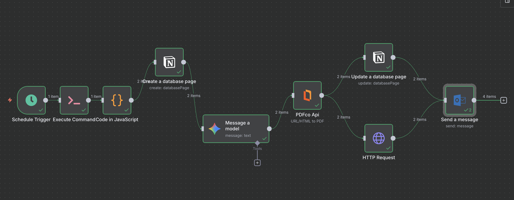
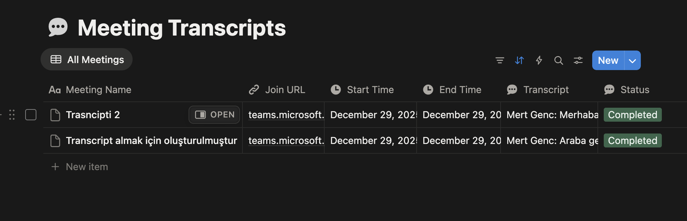

**Proje Geliştirme aşamasındadır**
# 🎓 Teams Transcript AI Agent & Multi-Platform Automation

Bu proje, Microsoft Teams toplantılarını otonom bir şekilde takip eden, toplantı dökümlerini (transcript) analiz edip profesyonel raporlara dönüştüren ve kurumsal araçlar (**Notion, Outlook**) arasında senkronize eden **uçtan uca bir mühendislik çözümüdür**.

---

## 📝 Proje Hakkında

Bu çalışma, kurumsal toplantı yönetimini tamamen otomatize etmek amacıyla geliştirilmiştir.  
Toplantı dökümlerinin manuel olarak özetlenmesi sürecini ortadan kaldırarak;

- Veri çekme  
- Veri temizleme  
- Yapay zeka analizi  
- Dokümantasyon  
- Rapor üretimi ve dağıtımı  

adımlarını **tek ve otonom bir iş akışında** birleştirir.

---

## 🛠️ Kullanılan Teknolojiler ve Araçlar

### 🔧 Orkestrasyon
- **n8n** (Self-Hosted / Docker)

### 💻 Programlama & Scripting
- **Python 3.x**
- **PowerShell**

### ☁️ Bulut API'leri
- **Microsoft Graph API**  
  - Teams Meeting Transcript  
  - Outlook Mail Services  

- **Google Gemini Pro API**  
  - NLP & Meeting Summarization  

- **PDF.co API**  
  - HTML → PDF dönüşümü  

- **Notion API**  
  - Database & Page Management  

### 📁 Veri Formatları
- JSON  
- VTT  
- HTML  
- Binary Data (PDF)

---

## 🏗️ Sistem Mimarisi & İş Akışı (Workflow)

Proje, **n8n üzerinde kurgulanmış ve birbirine entegre çalışan 9 ana aşamadan** oluşmaktadır:


### 🔁 Workflow Adımları

1. **Trigger (Schedule)**
   - Belirlenen periyotlarda (saatlik / günlük) otomatik tetikleme

2. **Extraction (Python & Microsoft Graph API)**
   - Python scripti ile MS Graph API üzerinden toplantı dökümleri çekilir

3. **Data Cleaning (Regex)**
   - VTT formatındaki ham metinler:
     - Zaman damgalarından arındırılır
     - Konuşmacı isimleri korunur

4. **Database Entry (Notion)**
   - Toplantı bilgileri Notion veritabanında yeni bir sayfa olarak kaydedilir

5. **AI Analysis (Google Gemini)**
   - Temizlenmiş transcript:
     - Toplantı amacı
     - Alınan kararlar
     - Aksiyon maddeleri  
   şeklinde **HTML formatında** özetlenir

6. **PDF Generation (PDF.co)**
   - Oluşturulan HTML içeriği profesyonel PDF raporuna dönüştürülür

7. **Data Update (Notion Update)**
   - PDF rapor linki ilgili Notion kaydına otomatik eklenir

8. **Binary Processing**
   - PDF dosyası binary veri olarak belleğe alınır

9. **Distribution (Microsoft Outlook)**
   - PDF ekli toplantı özeti, Outlook üzerinden ilgili kişilere gönderilir

---

## 💻 Teknik Detaylar

### 🐍 Python Entegrasyonu

Toplantı verilerinin çekilmesi ve temizlenmesi sürecinde Python kullanılmıştır.  
Yetkilendirme süreci **MSAL Client Credentials Flow** ile güvenli şekilde gerçekleştirilir.

#### Örnek VTT Temizleme Mantığı

```python
def clean_vtt(vtt_text):
    """
    - WEBVTT başlığını temizler
    - Zaman damgalarını kaldırır
    - <v Name> formatını 'Name:' formatına çevirir
    """
    pass

```
## ⚙️ n8n & PowerShell

Sistem;

- **Docker container**
- veya **lokal sunucu**

üzerinde çalışabilir.

PowerShell komutları aracılığıyla Python scriptleri tetiklenerek **hibrit bir otomasyon yapısı** sağlanır.

---

## 📸 Ekran Görüntüleri

### 1️⃣ n8n Workflow Genel Görünüm
*(n8n üzerinde oluşturulan tüm node'ların yer aldığı genel akış görünümü)*

### 2️⃣ Notion Veritabanı
*(Oluşturulan toplantı kayıtları ve güncellenen PDF linklerinin yer aldığı Notion tablosu)*

### 3️⃣ Gemini AI Çıktısı
*(Gemini Pro modeli tarafından üretilen toplantı özeti / HTML içerik örneği)*

### 4️⃣ Outlook Mail & PDF Eki
*Otomatik gönderilen e-posta ve ekli PDF raporun görünümü (PDF eki geliştirme aşamasındadır şuanlık indirme url'si göndermktedir) *

---

## ⚙️ Kurulum Talimatları

### 1️⃣ Azure Portal Ayarları

- Azure Portal üzerinden **App Registration** oluşturun
- Aşağıdaki izinleri ekleyin:

  - `OnlineMeetings.Read`
  - `Mail.Send`

---

### 2️⃣ Ortam Değişkenleri

Proje kök dizininde bir `.env` dosyası oluşturun:

```env
TENANT_ID=xxxxxxxx
CLIENT_ID=xxxxxxxx
CLIENT_SECRET=xxxxxxxx

```
## 📌 Lisans

Bu proje, **kişisel gelişim ve eğitim amaçlı** olarak geliştirilmiştir.

Otomasyon, bulut servisleri ve yapay zekâ entegrasyonu konularında teknik yetkinliklerin
gösterilmesi amacıyla açık olarak paylaşılmıştır.

